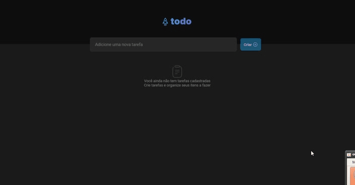

# toList

#### Desafio promovido pela Rocketseat

Nesse desafio, você vai desenvolver uma aplicação de controle de 
tarefas no estilo **to-do list**, que contém as seguintes funcionalidades:

- Adicionar uma nova tarefa
- Marcar e desmarcar uma tarefa como concluída
- Remover uma tarefa da listagem
- Mostrar o progresso de conclusão das tarefas

Apesar de serem poucas funcionalidades, você vai precisar relembrar conceitos como:

- Estados
- Imutabilidade do estado
- Listas e chaves no ReactJS
- Propriedades
- Componentização

 

  

 

---

##  *VITE*

Vite é uma ferramenta  de construção que visa fornecer uma experiência de  
desenvolvimento mais rápida e enxuta para projetos web modernos. É composto 
 por duas partes principais:

Um servidor de desenvolvimento que fornece aprimoramentos de recursos avançados 
 em módulos ES nativos , por exemplo, Hot Module Replacement (HMR) extremamente rápido.

Um comando de compilação que agrupa seu código com Rollup , pré-configurado para  
gerar ativos estáticos altamente otimizados para produção.

O Vite é opinativo e vem com padrões sensatos prontos para uso, mas também é altamente 
extensível por meio de sua API de plug -in e API JavaScript com suporte total à digitação.

Você pode aprender mais sobre a lógica por trás do projeto na seção Por que Vite .

---

